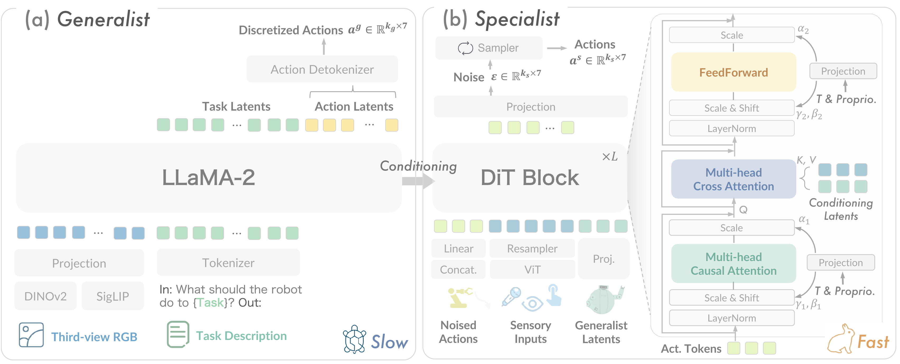
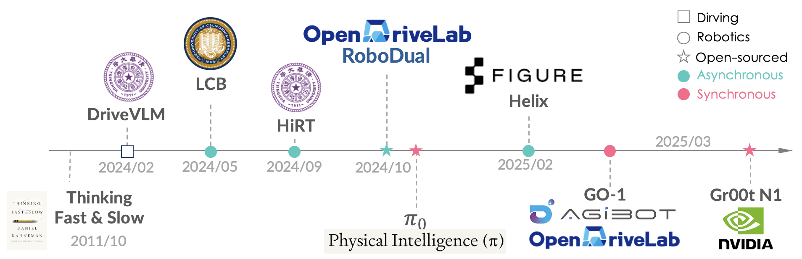

# :gemini:RoboDual
The official implementation of our paper: \
**Towards Synergistic, Generalized and Efficient Dual-System for Robotic Manipulation**
<div id="top" align="center">
<p align="center">

</p>
</div>

#### Overview of RoboDual:
> Our objective is to develop a synergistic dual-system framework which supplements the generalizability of large-scale pre-trained generalist with the efficient and task-specific adaptation of specialist. (a) The fast specialist policy obsesses real-time and accurate control by aid of the slow yet generalized outcome from the generalist one with large-scale data. (b) RoboDual exhibits significant improvement in terms of performance and efficiency over a single standalone option and surpasses previous state-of-the-arts in the real-robot setting.


> [Qingwen Bu](https://scholar.google.com/citations?user=-JCRysgAAAAJ&hl=zh-CN&oi=ao), [Li Chen](https://ilnehc.github.io/), _et al._

> #### 📝 [Paper](https://arxiv.org/pdf/2410.08001) | 🌍 [Project Page](https://opendrivelab.com/RoboDual/)

> :mailbox_with_mail: Point of contact: *Qingwen Bu* ( qingwen@opendrivelab.com ) or *Li Chen* ( ilnehc@opendrivelab.com )


## :fire: Highlight

<div id="top" align="center">
<p align="center">

</p>
</div>

- **[Auto-regressive Generalist + DIffusion Action Specialist**] We introduce a novel approach that integrates generalist and specialist policies into a synergistic framework, dubbed :gemini:RoboDual, following a **dual-system** spirit.
- **[Decoupled Training & Input]** The framework facilitates the flexible integration of diverse modalities and allows for the deconstruction of the two models on the aspect of training data, thereby enhancing their individual strengths and capabilities.

### Current Endeavors on Dual-systems

The trend of dual-systems for robotics is shown below. In particular, *Asynchronous* implementations include:
- [Helix](https://www.figure.ai/news/helix) from Figure
- [HiRT](https://arxiv.org/pdf/2410.05273) from Tsinghua
- [LCB](https://arxiv.org/pdf/2405.04798) from UC Berkeley
- **RoboDual** (This work)

<div id="top" align="center">
<p align="center">

</p>
</div>

> - Following RoboDual, the architecture of dual-systems in robotics converges to the 'VLM + Diffusion Transformer' paradigm.
> - Asynchronous inference with dual-system allows a more *decoupled* design and enables more flexible and scalable reasoning.
> - Beyond latents, explicit representations (*e.g.,* coarse action output from the System-2 as in RoboDual) should also be explored!


## :loudspeaker: News

- **[2025/04]** Code of RoboDual released. Check it out!
- **[2024/10]** We released our paper on [arXiv](https://arxiv.org/abs/2410.08001).


## :pushpin: TODO list

- [x] Release checkpoints for reproduction (*Scheduled Release Date*: **Mid-April, 2025**)


## :video_game: Getting Started <a name="installation"></a>

1. (Optional) We use conda to manage the environment.

```bash
conda create -n robodual python=3.10 -y
conda activate robodual
```

2. Install dependencies.

```bash
# Install pytorch
# Look up https://pytorch.org/get-started/previous-versions/ with your cuda version for a correct command
pip install torch torchvision torchaudio

# Clone our repo and pip install to download dependencies
git clone git@github.com:OpenDriveLab/RoboDual.git
cd robodual
pip install -e .

# Install Flash Attention 2 for training (https://github.com/Dao-AILab/flash-attention)
pip install packaging ninja
ninja --version; echo $?  # Verify Ninja --> should return exit code "0"
pip install "flash-attn==2.5.5" --no-build-isolation
```

3. Install CALVIN simulator.

```bash
git clone --recurse-submodules https://github.com/mees/calvin.git
export CALVIN_ROOT=$(pwd)/calvin
cd $CALVIN_ROOT
sh install.sh
```

## :star: Model Checkpoints

- Generalist Policy: [](https://huggingface.co/qwbu/RoboDual-OpenVLA-Generalist)
- Specialist Policy: [](https://huggingface.co/qwbu/RoboDual-Specialist)


## Experiment on CALVIN

### :ballot_box_with_check: Relevant Files:
> #### Training
- vla-scripts/
  - ```train_generalist_calvin.py```: Train OpenVLA on CALVIN dataset
  - ```train_specialist_calvin.py```: Train DiT specialist with pre-trained generalist
- prismatic/vla/datasets/
  - ```calvin_dataset.py```: Data loader for CALVIN dataset
> #### Evaluation
- vla-scripts/
  - ```evaluate_calvin.py```: Initiate evaluation on CALVIN
  - ```dual_sys_evaluation.py```: RoboDual-specific core implementation
> #### Model
- prismatic/models/policy/:
  - ```diffusion_policy.py```: Core implementation of our DiT action expert


### :one: Generalist Training
- Our generalist model is built upon OpenVLA, first change ```vla_path``` to your local path of OpenVLA model.
- By default, we employ parameter efficient fine-tuning with LoRA rank 32.
- Then initiate triaining with 8 GPUs:

```bash
torchrun --standalone --nnodes 1 --nproc-per-node 8 vla-scripts/train_generalist_calvin.py \
                                 --dataset_name "calvin" \
                                 --run_root_dir "run_log" \
```

### :two: Specialist Training
- We do not train generalist with the specialist with an end-to-end manner and find it works equally well on CALVIN. To further train generalist, modify ```freeze_slow = False``` in the config.
- Start training (100k steps) on CALVIN with 8 GPUs:
```bash
torchrun --standalone --nnodes 1 --nproc-per-node 8 vla-scripts/train_spacialist_calvin.py \
                                 --num_inference_steps 5 \       # sampling steps for DiT
                                 --cond_drop_chance 0.1 \        # condition drop chance for calssifier-free guidance
                                 --with_depth True \             # use depth input
                                 --with_gripper True \           # use gripper-view inputs (both RGB and depth)
                                 --with_tactile True \           # use visuo-tactile input
                                 --batch_size 8 \                # fine-tuning batch size
                                 --learning_rate 1e-4 \          # fine-tuning learning rate
                                 --dataset_name "calvin" \
                                 --run_root_dir "run_log" \
```

### :three: Evaluation <a name="Evaluation"></a>
> First set your ```CALVIN_ROOT``` environment variable wtih:
```bash
export CALVIN_ROOT=/path/to/your/calvin_root_path
```
- Start evaluation on CALVIN (multi-GPU is also supported):
```bash
torchrun --standalone --nnodes 1 --nproc-per-node 1 vla-scripts/evaluate_calvin.py \
                                 --generalist_path "/path/to/calvin_generalist" \
                                 --specialist_path "/path/to/calvin_specialist" \
                                 --with_depth \                 # use depth input
                                 --with_gripper \               # use gripper-view inputs (both RGB and depth)
                                 --with_cfg \                   # enable classifier-free guidance
                                 --log_dir calvin
```
> Please refer to ```vla-scripts/evaluate_calvin.py``` for all evaluation options.


## :pencil: Citation
If you find our code or models useful in your work, please cite [our paper](https://arxiv.org/abs/2410.08001):

```bibtex
@article{bu2024robodual,
  title={Towards Synergistic, Generalized, and Efficient Dual-System for Robotic Manipulation}, 
  author={Qingwen Bu and Hongyang Li and Li Chen and Jisong Cai and Jia Zeng and Heming Cui and Maoqing Yao and Yu Qiao},
  journal={arXiv preprint arXiv:2410.08001},
  year={2024}
}
```

## Acknowledgements

We thank [OpenVLA](https://github.com/openvla/openvla) and [Latte](https://github.com/Vchitect/Latte) for their open-sourced work!
